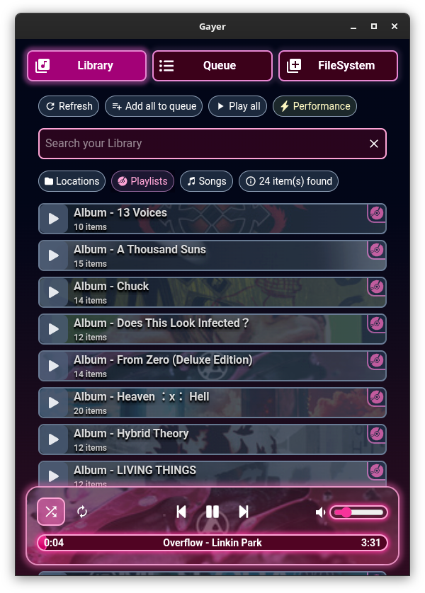
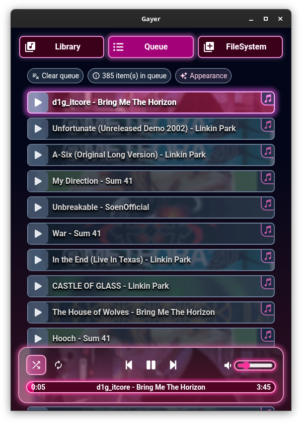
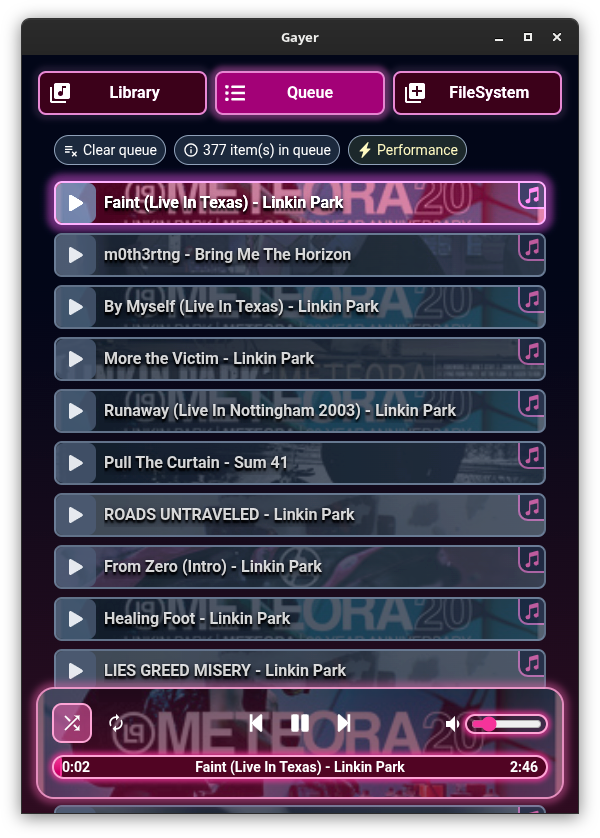

# Gleamy Audio Player

Local audio/music player :3


## Screenshots

<div>






</div>

## Features

- Play local audio in different ways
  - Drag and drop multiple files and folders from your file manager onto the app to add them to the queue
  - Build and search your own custom audio library in app, by registering locations from your computer
  - Manually select a folder to open
- Reorder and shuffle queue
- Create your own playlists
- Queue loop and currently played audio loop modes supported
- Power saving / appearance toggle, if your machine struggles with pretty blurs and overly long queues :p
- Automatically fetches album cover art using filename and parent directory name
- Looks cute and pretty :3

### Planned

- Export your playlists to .M3U format
- Fix incorrect cover art manually when it fails to find your music, or allow disabling auto fetching
- Search and download songs and albums directly from the internet, using yt-dlp

<br/>
Stay tuned and support the project by starring it >:3

## Hotkeys

- `space` : toggle pause / play
- `ctrl+right/left` | `ctrl+n/p` : next/previous song in queue
- `ctrl+l` : toggle loop modes
- `ctrl+s` : toggle shuffling
- `ctrl+up/down` : increase / decrease volume

## Recommended IDE Setup

- [VSCode](https://code.visualstudio.com/) + [ESLint](https://marketplace.visualstudio.com/items?itemName=dbaeumer.vscode-eslint) + [Prettier](https://marketplace.visualstudio.com/items?itemName=esbenp.prettier-vscode)

## Project Setup

### Requirements

- [Node.js](https://nodejs.org/fr/download)

### Install

```bash
$ npm install
```

### Development

```bash
$ npm run dev
```

### Build

```bash
# For Linux
$ npm run build:linux

# For Windows
$ npm run build:win

# For MacOS
$ npm run build:mac
```

## Disclaimer

Fuck AI

---

🇵🇸🇺🇦🏳️‍⚧️🏳️‍🌈
