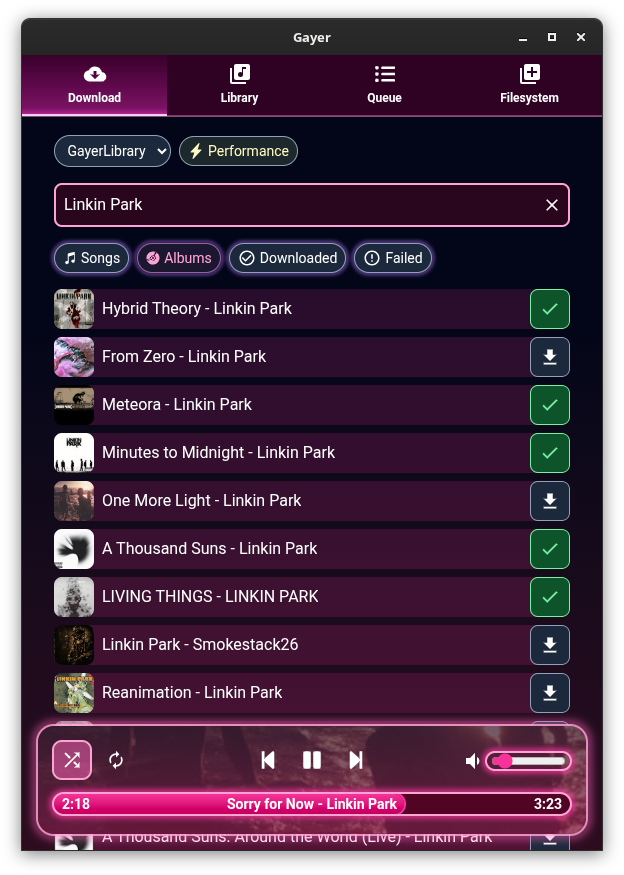
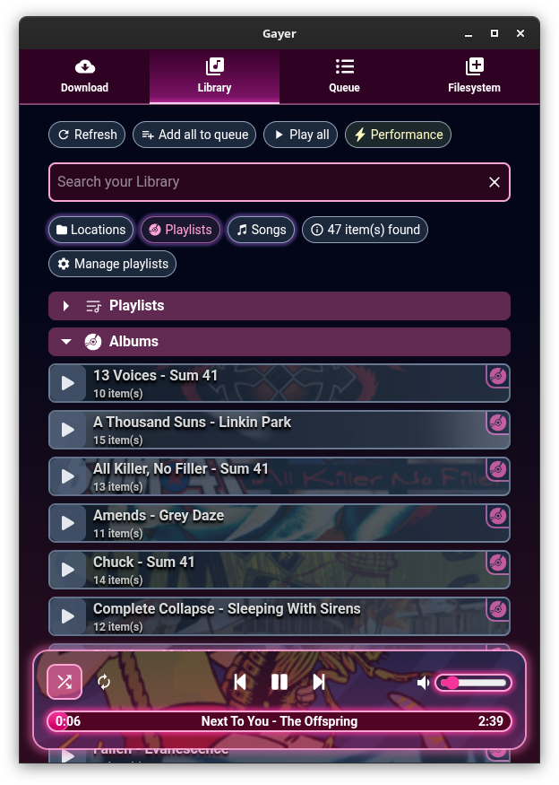
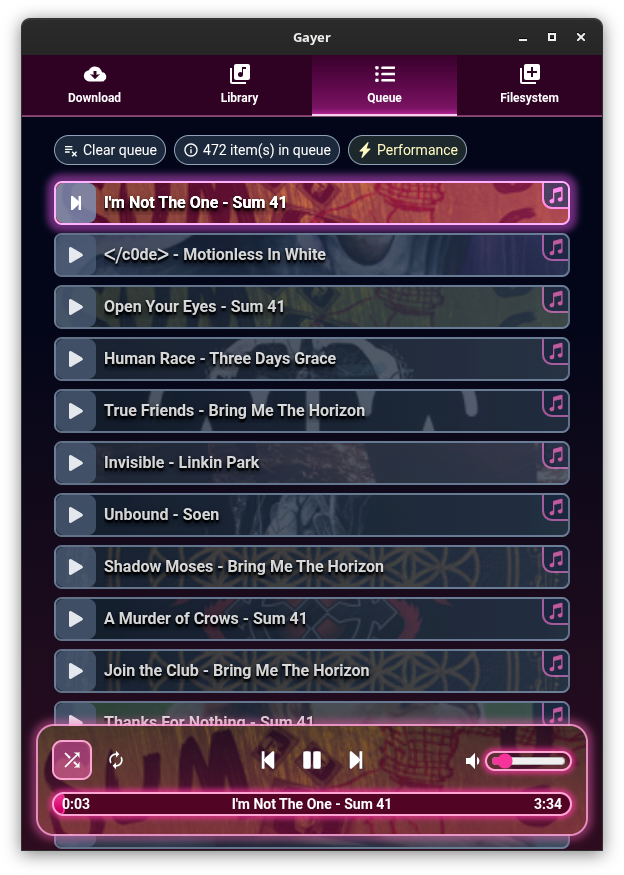

# Gleamy Audio Player

Local music player and downloader :3


## Screenshots

<div>





</div>

## Features

- Play local audio in different ways
- Drag and drop multiple files and folders from your file manager onto the app to add them to the queue
- Build and search your own custom audio library in app, by registering locations from your computer
- Manually select a folder to open
- Reorder and shuffle queue
- Loop current or whole queue
- Create your own playlists
- Import and export your playlists to .M3U format
- Automatically download missing playlist tracks
- Search and download songs and albums directly from the internet, using yt-dlp
- Allow downloading songs and playlists using direct url
- Power saving / appearance toggle, if your machine struggles with pretty blurs and overly long queues :p
- Automatically fetches album cover art using filename and parent directory name
- Link your Youtube account (by using your browser's cookies) to download content that fails otherwise
- Enable / disable auto cover art fetching
- Looks cute and pretty :3

### Planned

- Fix incorrect cover art manually when it fails to find your music
- Audio visualizer
- Lyrics support

<br/>
Stay tuned and support the project by starring it >:3

## Hotkeys

- `(ctrl+)space` : toggle pause / play (spacebar works on its own, unless you're typing in a searchbar, in which case ctrl+space comes in handy)
- `ctrl+right/left` | `ctrl+n/p` : next/previous song in queue
- `ctrl+l` : toggle loop modes
- `ctrl+s` : toggle shuffling
- `ctrl+k` : add current track to playlist
- `ctrl+t/f` : scroll to top and focus search bar
- `ctrl+tab` : switch tab
- `ctrl+j` : switch filter (subtabs/categories)
- `ctrl+up/down` : increase / decrease volume

## Recommended IDE Setup

- [VSCode](https://code.visualstudio.com/) + [ESLint](https://marketplace.visualstudio.com/items?itemName=dbaeumer.vscode-eslint) + [Prettier](https://marketplace.visualstudio.com/items?itemName=esbenp.prettier-vscode)

## Project Setup

### Requirements

- [Node.js](https://nodejs.org/fr/download)

### Install

```bash
npm install
```

### Development

#### Updates

1. Create a GitHub access token, fine grained to only access read-only repository content metadata
2. Create a file `updates/TOKEN` and paste the created token

```bash
npm run dev
```

### Build

```bash
# For Linux
$ npm run build:linux

# For Windows
$ npm run build:win

# For MacOS
$ npm run build:mac
```

## Disclaimer

This project is not affiliated with, funded, authorized, endorsed by, or in any way associated with YouTube, Google LLC, or any of their affiliates and subsidiaries.

All trademarks, service marks, and intellectual property rights referenced in this project belong to their respective owners.

Fuck AI

---

🇵🇸🇺🇦🏳️‍⚧️🏳️‍🌈
